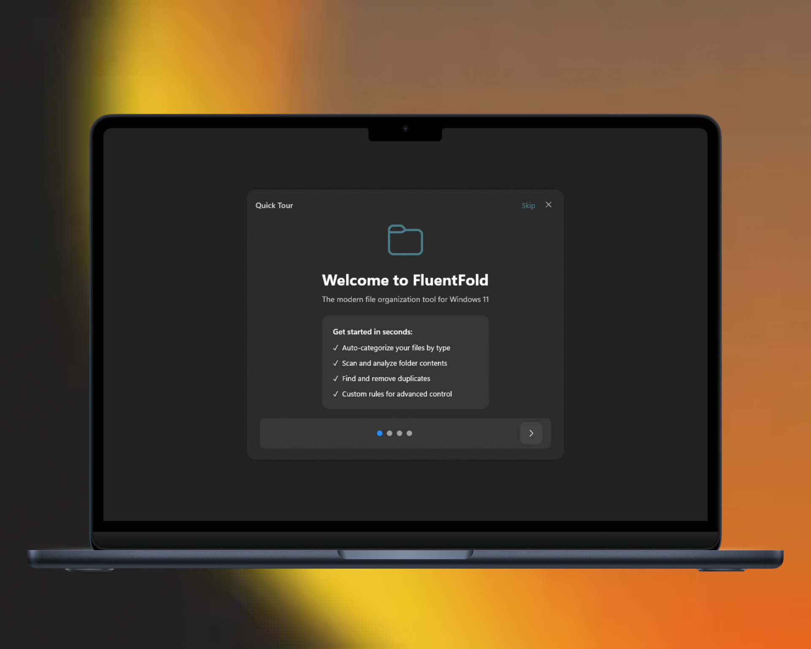
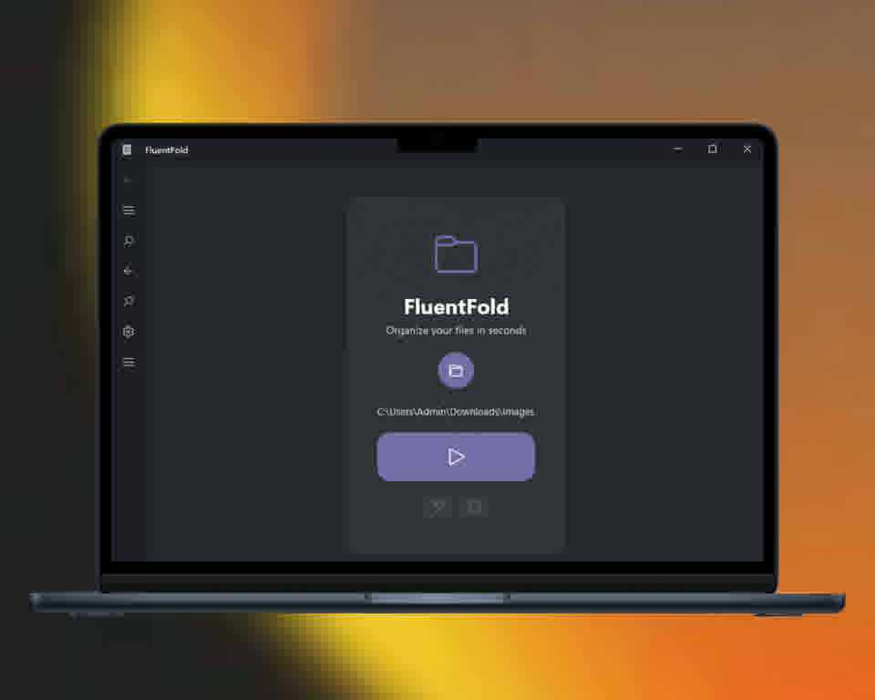
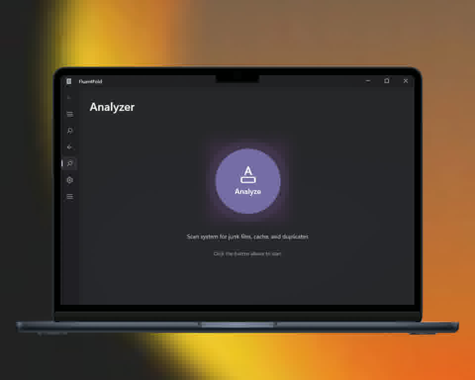

<div align="center">

# Fluent Fold

**Organize your files. Reclaim your space.**

[](https://github.com/MoHamed-B-M/Fluent-Fold/actions)
[](https://www.microsoft.com/windows)
[](https://dotnet.microsoft.com)
[](https://docs.microsoft.com/windows/apps/winui/winui3/)
[](LICENSE)

</div>

## Screenshots

|  |  |  |

---

## Features

| Category | Feature | Description |
|:---|:---|---|
| **File Organization** | Auto-categorize | Sorts files into `Images`, `Documents`, `Videos`, `Audio`, `Archives`, `Code`, `Other` |
| | Bulk rename | Apply custom naming patterns with sequential numbering |
| | Undo last operation | Revert the most recent organize operation with one click |
| | Pro mode | Advanced controls with extended rule matching |
| **System Analysis** | Storage dashboard | Visual breakdown of disk usage by category |
| | Duplicate detection | Find and review duplicate files across your system |
| | Temp file cleanup | Identify and remove temporary/stale/cache files |
| **User Experience** | Mica backdrop | Modern Windows 11 acrylic material |
| | Dark / Light theme | Toggle in Settings or follow system preference |
| | Onboarding tour | Interactive 4-slide introduction on first launch |
| | InfoBar notifications | In-app status messages for success, warning, errors |
| | Teaching tips | Optional tooltips to guide new users |

---

## Tech Stack

| Technology | Version | Purpose |
|:---|---:|:---|
| .NET | 10.0 | Runtime & framework |
| Windows App SDK | 2.3.1 | WinUI 3 controls & platform interop |
| WinUI 3 | — | Modern native UI layer |
| CommunityToolkit.Mvvm | 8.4.0 | Source-generated MVVM (ObservableProperty, RelayCommand) |
| Microsoft.Extensions.DI | 9.0.4 | Dependency injection container |
| Microsoft.Extensions.Logging | 9.0.4 | Structured logging with `ILogger<T>` |
| MSIX / Inno Setup | — | Package & installer distribution |

---

## Download

Get the latest build from the [Releases page](https://github.com/MoHamed-B-M/Fluent-Fold/releases).

| Package | Format | Description |
|:---|---:|:---|
| **Installer** | `.exe` | Inno Setup installer — admin install, Start Menu + Desktop shortcuts, uninstall support |
| **MSIX (x64)** | `.msix` | Side-loadable app package for x64 devices |
| **MSIX (x86)** | `.msix` | Side-loadable app package for x86 devices |
| **MSIX (ARM64)** | `.msix` | Side-loadable app package for ARM64 devices |

### Microsoft Store

[](https://aka.ms/fluentfold-store)

---

## Getting Started

### Prerequisites

- Windows 10 1809+ (build 17763)
- [Microsoft Visual C++ Redistributable](https://aka.ms/vs/17/release/vc_redist.x64.exe) (auto-installed with the setup)

### Installation

1. Download `FluentFold-x64-Setup.exe` from the latest release
2. Run the installer (admin privileges required)
3. Launch FluentFold from the Start Menu or Desktop shortcut

### Build from source

#### With Visual Studio 2022

```bash
git clone https://github.com/MoHamed-B-M/Fluent-Fold.git
cd FluentFold
# Open FluentFold.sln, set FluentFold as startup project, build & run (F5)
```

#### With .NET CLI

```bash
dotnet restore -p:Platform=x64
dotnet build -c Release -p:Platform=x64
dotnet publish -c Release -p:Platform=x64 -p:RuntimeIdentifier=win-x64 -p:SelfContained=true
```

The published output is at `bin\Release\net10.0-windows10.0.26100.0\win-x64\publish\`.

---

## Architecture

```
FluentFold/
├── App.xaml / .cs          Entry point, DI config, splash
├── MainWindow.xaml / .cs   Navigation shell + onboarding overlay
├── Models/                 Data objects & observable models
│   ├── FileEntry.cs, FileMove.cs
│   ├── OrganizeOperation.cs, RuleModel.cs
│   ├── DuplicateFileEntry.cs, AnalyzerItem.cs
│   └── DashboardCard.cs, CleanupFileItem.cs
├── ViewModels/             MVVM view models (CommunityToolkit.Mvvm)
│   ├── MainViewModel.cs    Navigation logic
│   ├── OrganizerViewModel.cs  Folder scan, organize, rename
│   ├── AnalyzerViewModel.cs   System analysis, dashboard
│   ├── HistoryViewModel.cs    Undo history
│   └── SettingsViewModel.cs   App settings, theme
├── Views/                  XAML pages
│   ├── OrganizerPage.xaml      File organizer (Standard + Pro)
│   ├── AnalyzerPage.xaml       System analysis with dashboard
│   ├── HistoryPage.xaml        Operation history
│   ├── SettingsPage.xaml       Settings form
│   └── AboutPage.xaml          Version info, GitHub link
├── Services/               Interface-based services (DI)
│   ├── IAppSettingsService     LocalSettings persistence
│   ├── IFirstLaunchService     Onboarding state
│   ├── IFolderPickerService    Folder picker (FutureAccessList)
│   ├── IOrganizerService       File scan, organize, undo
│   ├── IAnalyzerService        System temp/duplicate scan
│   ├── IRenamingService        Pattern-based bulk rename
│   ├── IUndoService            Operation history stack
│   └── IWindowService          Win32 window handle interop
└── Assets/                 App resources
    ├── AppIcon.ico
    ├── logo.png
    ├── GitHubLogo.svg
    └── screenshots/            Screenshots for README
```

### Key patterns

- **MVVM** — Views bind to ViewModels via `x:Bind`; source-generated with `[ObservableProperty]` / `[RelayCommand]`
- **Dependency Injection** — `IServiceProvider` wired in `App.OnLaunched()`, passed via constructor injection
- **Service layer** — All business logic behind `I{Name}Service` interfaces for testability
- **Frame navigation** — No MVVM navigation framework; `MainViewModel` holds a `Frame` reference and calls `Navigate()`

---

## CI/CD

| Workflow | Triggers | Artifacts |
|:---|---:|:---|
| `build.yml` | Push / PR to `main` | `FluentFold-x64.msix`, `FluentFold-x86.msix`, `FluentFold-arm64.msix`, `FluentFold-x64-Setup.exe` |

Code-signing is supported by setting `CERT_BASE64` / `CERT_PASSWORD` secrets in the repository.

---

## License

MIT — see [LICENSE](LICENSE).
